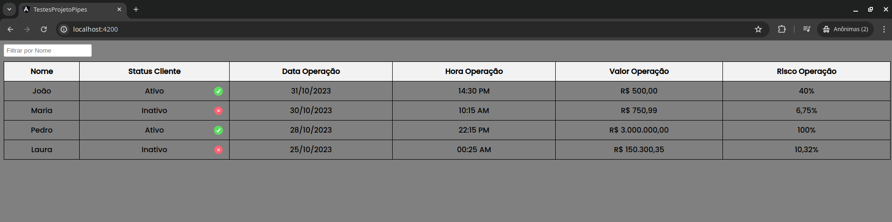
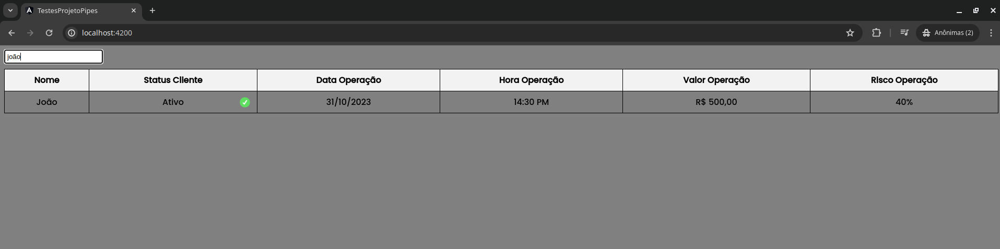

# Projeto_Pipes

[Angular CLI] version 17.3.6.

## Development server

Run `ng serve` for a dev server. Navigate to `http://localhost:4200/`.

## Build

Run `ng build` to build the project. The build artifacts will be stored in the `dist/` directory.

## Interface gráfica

